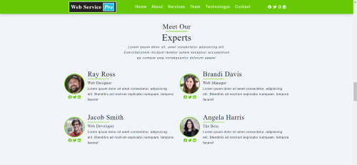

# WEB SERVICE PRO

[SEE FULL SITE HERE ON NETLIFY](https://webservicepro.netlify.app/)

# Technologies Used

## _**Built With HTML & CSS**_

## _**Built With Javascript**_

# Website Content

## _**HEADER**_

## _**ABOUT HEADER SECTION**_

## _**WEB DEV SERVICES SECTION**_

## _**WEB SERVICES SECTION**_

## _**MORE SERVICES SECTION**_

## _**HOW IT WORKS SECTION**_

## _**WEB EXPERTS**_

## _**WEB EXPERIENCE**_

## _**KEY SERVICES**_

## _**TECHNOLOGYS & WEB DESIGN**_

## _**CONTACT SECTION**_

## _**FOOTER**_

